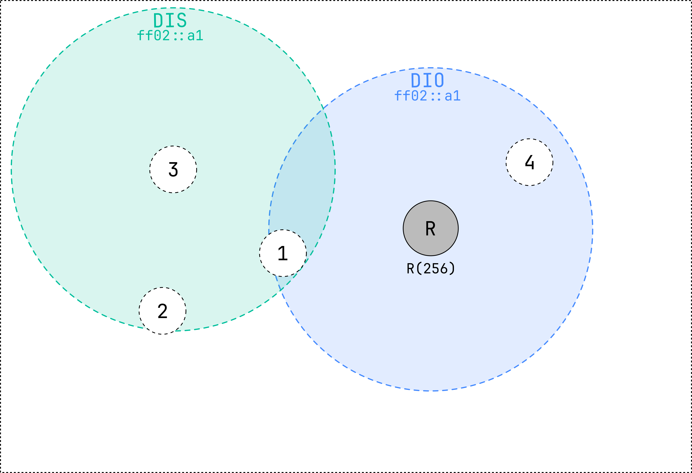

# MOP0: no downward routes maintained

In this mode of operation, the network is configured such that only upward routes are established.
This means that any node in the network can transmit messages to the root node
or any other node on its path towards the root, but not to other nodes in the network.
The default route, represented by the parent of the node,
is used to transmit data packets in an upward direction.

```admonish note
In this mode of operation, **only** DIS and DIO messages are sent.
```

## RPL network formation ##

The following network contains 5 nodes.
The root node (R) and 4 normal nodes.
They are all using the same RPL Instance ID, Mode of Operation and Objective Function.


<small>Figure 1: an empty network with 4 normal nodes and 1 root node.</small>

The root node periodically sends a *DODAG Information Object (DIO)* packet, 
which contains information about the RPL network, more specifically about the DODAG.
The *DIO* message is sent using the *all-RPL-node* IPv6 multicast address (`ff02::a1`).
Nodes that receive this message will join the RPL network and select the root node as their parent.
These nodes will also set their rank based on the objective function and the information received in the *DIO* message.
They will also start sending *DIO* messages.

A node that does not hear any *DIO* message but wants to join a RPL network can send a *DODAG Information Solicitation (DIS)* message.
This message is sent to the *all-RPL-node* IPv6 multicast address (`ff02::a1`).
A node that is part of a RPL network will respond to this message with a *DIO* message.


<small>
Figure 2: the root transmits a *DIO* and node 1 and 4 receive it.
Node 3 transmits a *DIS* message.
</small>

Nodes 1 and 4 have selected the root node as their parent and have calculated their rank.
They now start to transmit *DIO* messages as well, based on the Trickle Timer algorithm.
Since node 2 and 3 are in range of node 1, they will receive the *DIO* message and join the RPL network.

The root node also hears the *DIO* message from node 1 and 4, however, since their rank is higher than the root node's rank,
the root node will ignore the *DIO* message.
This guarantees optimal route selection and avoids loops.


<small>
Figure 3: node 2 and 3 receive the *DIO* message from node 1 and 4 and join the RPL network.
Node 2 and 3 start sending *DIO* messages as well.
</small>

Every node in the network now has a parent and a rank.
They will continue to send *DIO* messages based on the Trickle Timer algorithm.
Other packets, such as data packets, are sent using the default route, which is the parent of the node.
This means that data packets will always be sent in an upward direction, towards the root node.
Node 1 will never be able to send a data packet to node 4, since node 4 is not on the path towards the root node.
Neither will 3 be able to send a data packet to 2.
However, node 2 can send a data packet to node 1, since node 1 is on the path towards the root node.
This is not the use case for this mode of operation, but it is possible.
The use case for this mode of operation is to send data packets to the root node,
which collects the data and sends it to a server.


<small>
Figure 4: the network is formed.
</small>

## Maintenance of a RPL network ##

The *DIO* messages will be sent by nodes even after the DODAG is formed. The goal of sending *DIO* messages for the whole 
life of a RPL network is to maintain or upgrade the formed DODAG. However, the constant generation of control messages 
can consume a lot of energy. To preserve resources, the sending of control messages is minimized and only done when necessary,
through the use of the **Trickle Timer algorithm**.

The **Trickle Timer algorithm** monitors the consistency of packet exchange in the network. If the pattern is consistent 
and free of redundant or outdated data, the Trickle Timer decreases the rate of sending *DIO* messages exponentially.
However, if there are any inconsistencies in the network, the next *DIO* message is rescheduled and sent at the shortest 
possible time interval. In other words, this algorithm ensures that *DIOs* are aggressively advertised when the 
network is unstable and advertised at a slower pace when it is stable.

There are four parameters that control the functioning of the Trickle Timer:

- \\(I_{min}\\), which represents the minimum time interval between two *DIO* messages

- \\(I_{max}\\), which represents the maximum time interval between two *DIO* message

- \\(k\\), which represents the redundancy constant (the number of redundant control messages)

- \\(I\\), which represents the size of the current time-interval

In the beginning, \\(I\\) is set to a random value between \\(I_{min}\\) and \\(2 \cdot I_{min}\\).
*DIO* messages are sent when \\(I\\) expires and if the
counter (\\(c\\)) that keeps track of the consistent received messages is smaller than \\(k\\). 
If the network is stable, \\(I\\) is doubled until it reaches \\(I_{max}\\).
However, if inconsistencies are detected in the network, 
\\(I\\) is reset to a value between \\(I_{min}\\) and \\(2 \cdot I_{min}\\).
This ensures efficient use of resources while still being able to ensure the maintainance of the network.

# Summary #

- Network is formed by sending *DIO* messages
- *DIO* messages are sent periodically using the Trickle Timer algorithm
- *DIO* messages are sent to the *all-RPL-node* IPv6 multicast address (`ff02::a1`)
- Nodes that receive a *DIO* message will join the RPL network
- Nodes that do not receive a *DIO* message can send a *DIS* message
- Packets only travel in an upward direction
  
