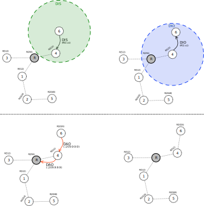
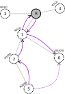

# Mode of Operation 1: downward routes (non-storing mode)

In **MOP 1** the message exchange for building a network starts the same way as it does in MOP 0:
a node that wants to join a network will send a *DIS* message and the nodes that are already
part of the network will respond with a *DIO* message.

In **MOP 1** after receiving a *DIO* message and selecting the parent and setting the rank,
the node will answer with a *DAO* message. In **MOP 1** this message is sent to the root. 
The *DAO* message contains information about the parent of the node. The address of the 
preferred parent is transmitted in the **Transit Information RPL option** of the *DAO* message.  

The node receiving the *DAO* message can answer with a *DAO-ACK* message. 

## P2M and P2P communication ##

In **MOP 1**, the network is configured such that both upward and downward routes are established. This means that 
the root can send data packets to the nodes in the network and that any node in the network can transmit messages to any other node. 

When forwarding the packet upward the default route is used, until the packet is received by the root. In non-storing mode the root is the only node that has knowledge about all the children-parent relationships 
in the network. Based on this information the root adds a new header to the packet, the **source
routing header (SRH)**. In the address field of the SRH the path that the packet needs to follow
toward the destination is inserted.

