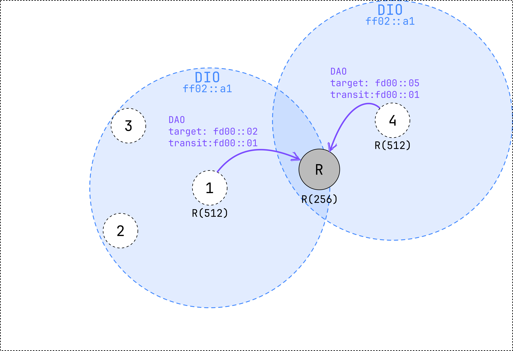
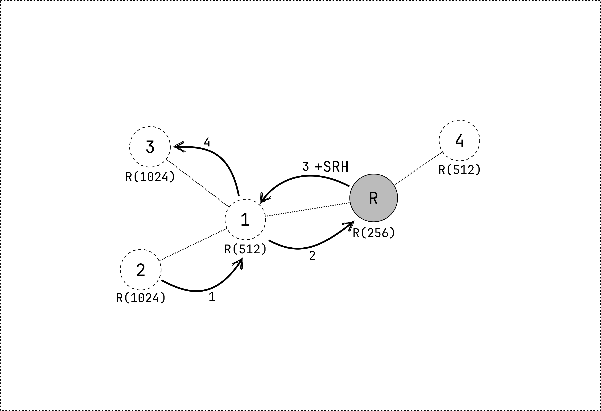

# MOP1: non-storing mode

In this mode of operation, the network is configured such that both upward and downward routes are established.
This means that the root can send data packets to the nodes in the network 
and that any node in the network can transmit messages to any other node.

```admonish note
In this mode of operation, IPv6 routing headers are used.
```

## RPL network formation ##

The formation of the network is done in the same way as in **MOP 0**.
However, in **MOP 1** the *DAO* messages are sent to the root when joining the network.
The root will answer with a *DAO-ACK* message, if requested by the *DAO* message.

A *DAO* message contains information about the parent of the node.
The address of the preferred parent is transmitted in the **Transit Information RPL option** of the *DAO* message.
The address of the child is transmitted in the **Target RPL option** of the *DAO* message.

When the root receives a *DAO* message, it will add the address of the child to its routing table together with the address of the parent.
When the network is formed, the root has a complete overview of the network topology.


<small>
Figure 1: node 1 and 4 send a *DAO* message to the root after joining the network.
</small>

Nodes can now send data packets to any other node in the network.
First, the packet is sent to the parent of the node until it reaches the root.
The root will then add a **source routing header (SRH)** to the packet.
The SRH contains the path that the packet needs to follow toward the destination.
It is constructed by the root based on the routing table.

```admonish example
Node 2 transmits a packet to node 3 (imagine that node 3 is not in range of node 2).
1. The packet is first transmitted to the preferred parent of node 2 (node 1).
2. Since node 1 is not the root, it will forward the packet to its preferred parent (the root).
3. The root will add a source routing header to the packet and send it to node 1.
4. Node 1 uses the source routing header to transmit the packet to node 3.


```

## Maintainance of the network ##

Just like in **MOP 0**, the network is maintained by sending *DIO* messages based on the **Trickle timer**.
However, routes also need to be maintained.
This is done by sending *DAO* messages to the root.
The root increments the DTSN in its *DIO* messages.
When a node receives a *DIO* message with a higher DTSN, it will send a *DAO* message to the root.
In smoltcp, nodes periodically send *DAO* messages to the root, without waiting for a *DIO* message with a higher DTSN.

# Summary #

- Network is formed by sending *DIO* messages
- When a node joins the network, it sends a *DAO* message to the root
- The root answers with a *DAO-ACK* message (if requested)
- The root has a complete overview of the network topology
- Nodes can send data packets to any other node in the network
- The root adds a **source routing header (SRH)** to downward packets
