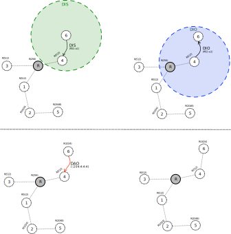
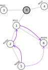

# Mode of Operation 2: downward routes (storing mode, without multicast)

In **MOP 2** the message exchange for building a network starts the same way as it does in MOP 0: 
a node that wants to join a network will send a *DIS* message and the nodes that are already 
part of the network will respond with a *DIO* message.

In **MOP 2** after receiving a *DIO* message and selecting the parent and setting the rank, 
the node will answer with a *DAO* message. In **MOP 2** this message is sent to the preferred parent. 
Based on the uinformation received through the *DAO* messages, all the nodes in the network 
will store a routing table containing information on how to reach all their descendants 
(all the nodes in their subtree). 

The node receiving the *DAO* message can answer with a *DAO-ACK* message. 

## P2M and P2P communication ##

In **MOP 2**, the network is configured such that both upward and downward routes are established. This means that 
the root can send data packets to the nodes in the network and that any node in the network can transmit messages to any other node. 

When forwarding the packet upward the default route is used, until the packet is received by a common ancestor
of the sender and receiver. The common ancestor will redirect the packet based on the information stored in its
routing table.

