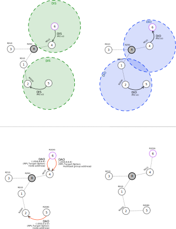

# Mode of Operation 3: downward routes (storing mode, with multicast)

In **MOP 3** the message exchange for building a network starts the same way as it does in MOP 0: 
a node that wants to join a network will send a *DIS* message and the nodes that are already 
part of the network will respond with a *DIO* message.

In **MOP 3** after receiving a *DIO* message and selecting the parent and setting the rank, 
the node will answer with a *DAO* message with the address of the sender in the RPL Target Option. In **MOP 3** this message is sent to the preferred parent and is then propagated towards the root. If the node is part of a multicast group (node 6 in the picture below), a second **DAO** message is sent to the preferred parent and propagated to the root. This message will contain in the RPL Target Option the multicast group address. This allows the root to know which nodes are part of a multicast group. 

