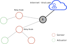
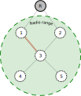

# Routing Protocol for Low-Power and Lossy Networks

A Wireless Sensor Network (WSN) is a type of Low-Power and Lossy Network (LLN) 
that consists of small, constrained devices equipped with sensors and/or actuators. 
These devices are connected to the Internet and an end user through a central node 
known as the sink node. 
WSNs may include hundreds of these tiny, battery-powered devices that communicate 
with each other using short-range radio transmissions. 
In order to transmit data from one device to another, intermediate nodes act as relay nodes, 
forwarding the data along a multi-hop path towards the sink node. 
The use of low-power, lossy radio links, battery-powered nodes, 
and mesh topologies creates significant routing challenges for LLNs and WSNs.

To address these challenges, the IETF Routing over Low-Power and Lossy Networks working group developed 
[**IPv6 Routing protocol for Low-power and Lossy Networks (RPL)**](https://datatracker.ietf.org/doc/html/rfc6550). RPL supports *Point to Point (**P2P**)*, *Multipoint to Point (**M2P**)* and *Point to Multipoint (**P2M**)* traffic. 
**P2P** communication occurs between two nodes, **M2P** communication involves 
data being sent from multiple nodes to a central node, and **P2M** communication 
involves data being sent from a central node to multiple nodes. RPL uses **upward** 
and **downward routes** to facilitate these different types of traffic. Upward routes 
lead towards the root of the network, while downward routes start at the root and lead 
towards other nodes in the network.

## Destination Oriented Directed Acyclic Graph (DODAG)

RPL specifies how to construct a Directed Acyclic Graph (DAG) rooted at a single destination, 
known as a Destination-Oriented DAG (DODAG), using an objective function and a set of metrics and constraints. 
The objective function evaluates a combination of metrics and constraints to determine 
the "best" path for packets to follow.

## General Concepts ##

In a WSN, the **neighbors** of a particular node are all the nodes that can be reached via single hop radio links.
In the example below, the neighbors of node 3 are: node 1, node 2, node 4, and node 5. 
The **parents** of a node are all its neighbors that are part of a possible route to the sink node. 
In the example below the parents of node 3 are node 1 and node 2. The **preferred parent** 
of a node is the neighbor that is on the best route from the node to the sink, such as node 1 for node 3.  

In a network using RPL, the **rank** of each node is a measure of its distance from the root node. 
This rank is determined using **routing metrics**, which include characteristics of both 
the **links** (such as throughput, latency, link reliability, expected transmission count, 
link quality level) and the **nodes** (such as energy state). 
These metrics are used in **objective functions** to calculate the cost of a route between nodes. 

A **RPL instance** is a group of DODAGs that have the same RPL instance ID and share a common root node, 
identified by a DODAG ID. The **DODAG version number** is a counter that is incremented by the root node 
whenever a new version of the DODAG is created.

## Control Messages and Modes of Operation ##

The DODAG is created with the assistance of control messages, specifically ICMPv6 messages. 
These messages are used to maintain both upward and downward routes within the DODAG. 
The four types of control messages that RPL uses to construct the DODAG are:

• DODAG Information Object (DIO)

• Destination Advertisement Object (DAO)

• Destination Advertisement Object Acknowledgment (DAO-ACK)

• DODAG Information Solicitation (DIS).

The exchange of control messages during the construction of the DODAG may vary depending on the mode of operation that is set for RPL.
In some modes of operation, some of these messages may not be sent at all. 
The mode of operation determines the specific message exchange that occurs during the construction of the DODAG.

There are 4 modes of operation defined in RPL standard:

**• MOP 0 = no downward routes maintained**

In this MOP, DAO messages are disabled and the DODAG only maintains upward routes. 
This means that nodes will not transmit or will ignore the DAO messages. 
However, DIO and DIS messages are still sent. In this MOP, only M2P communication is possible.

**• MOP 1 = non storing mode**

In this MOP, both upward and downward routes are supported within the DODAG. 
Thus, DIO, DIS, and DAO messages are issued. 
As this is a non-storing mode, the DAO messages are sent to the root. 
In this MOP, all three types of communication are possible: M2P, P2M, and P2P. 
However, multicast is not supported in this MOP.

**• MOP 2 = storing mode with no multicast support**

In this MOP, support is provided for both upward and downward routes within the DODAG. 
This is achieved through the issuance of DIO, DIS, and DAO messages. 
As this is a storing mode, the DAO messages are sent to the preferred parent. 
In this MOP, all three types of communication are possible: M2P, P2M, and P2P.
However, multicast is not supported in this MOP.

**• MOP 3 = storing mode with multicast support**

This MOP is similar to MOP2, but includes support for multicast. 

The root and nodes that are already part of a DODAG advertise this MOP. 
The MOP is included in the DIO messages. 
In order to join the network, nodes must support the MOP advertised in the DIO messages, 
otherwise, they can only join the network as leaf nodes.

